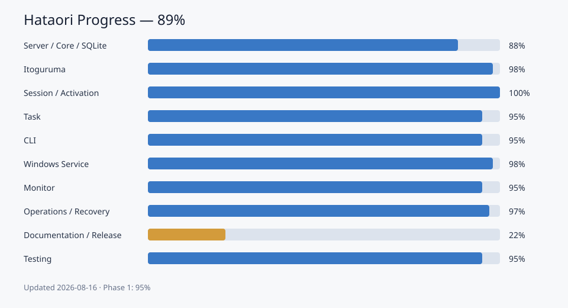

# PROGRESS.md Version
2026.08.31

# 変更履歴

- 2026.09.01: 複数Activation root対応を3.1.15.0としてMSI化。198テスト、実機Major Upgrade、2 root MCP列挙を検証。
- 2026.09.01: 3.1.14.0をRelease。Workspace管理v2をMSI化し、193テスト、実機Major Upgrade、Service・MCP・doctorを検証。
- 2026.09.01: 複数Activation root設定とWorkspace別Itoguruma取り込みを実装し、198テストを検証。
- 2026.08.31: Workspace管理v2を実装。Session・Message・Agent RunへWorkspace IDを伝播し、既存SQLite移行、Monitor表示、CLI filter、193テストを検証。
- 2026.08.31: 3.1.13.0をRelease。Workspace単位のTask管理、`list_workspaces`、SQLite移行、Monitor・会話Hook連携を実装し、189テストと実機Major Upgradeを検証。
- 2026.08.31: 3.1.12.0をRelease。MCP `list_projects`、未登録Project候補返却、Task登録前Project選択案内を実装し、179テストと実機Major Upgradeを検証。
- 2026.08.26: 3.1.9.0をRelease。MCP Server Instructionsと`hataori_workflow` Promptを追加し、実機Major UpgradeとMCP配信を検証。
- 2026.08.25: 3.1.8.0をRelease。MCP outputSchema契約修正とActivation既定値のBind時重複修正（新規Install起動クラッシュの原因）を反映。
- 2026.08.18
- 2026.08.16

# Hataori 進捗率履歴

この文書は、Hataoriの機能別進捗率、完了内容、残作業の正本です。

## グラフ

## 運用ルール

- 原則3日周期で日付列を追加します。
- 各機能は、実装・自動テスト・実環境確認・利用者文書の充足度から算定します。
- プロジェクト全体は、下表10機能の単純平均を整数四捨五入します。
- Phase 1は、仕様書のCore、Itoguruma、Session / Activation、Task、Monitorの単純平均です。

## 履歴

### ≪Hataori≫

| 機能 | 2026.08.16 | 2026.08.18 | 2026.08.25 | 2026.08.26 | 2026.08.31 |
| :--- | ---: | ---: | ---: | ---: | ---: |
| **グループ全体** | **94%** | **96%** | **96%** | **96%** | **97%** |
| Server / Core / SQLite | 88% | 88% | 88% | 88% | 88% |
| Itoguruma連携 | 98% | 98% | 98% | 98% | 98% |
| Session / Activation | 100% | 100% | 100% | 100% | 100% |
| Task管理 | 95% | 95% | 95% | 95% | 97% |
| CLI | 97% | 98% | 98% | 98% | 98% |
| Windows Service | 100% | 100% | 100% | 100% | 100% |
| Monitor | 95% | 95% | 95% | 95% | 96% |
| 運用・復旧 | 97% | 99% | 100% | 100% | 100% |
| 文書・配布 | 75% | 90% | 90% | 90% | 95% |
| テスト | 96% | 96% | 97% | 97% | 99% |

## 現在フェーズ

Phase 1（基盤・必須運用機能）: **96%**

算定: Core 88%、Itoguruma 98%、Session / Activation 100%、Task 97%、Monitor 96%の単純平均（95.8%）です。

## 進捗予測メモ

2026.09.01に複数Activation root対応を3.1.15.0としてMSI化しました。Release構成buildは警告0件・エラー0件、自動テスト198件合格、WiX MSI buildは警告0件・エラー0件でした。3.1.14.0から`F:\Hataori`への実機Major Upgradeは終了コード0で成功しました。一時的な`default`・`validation`の2 root設定で`list_workspaces`が両Workspaceと各Projectを返し、`list_projects`が第2 rootの`labproject`を返すことを確認後、設定とServiceを元の正常状態へ復元しました。検証記録は`docs/validation/2026-09-01-installer-3.1.15.0.md`です。

2026.09.01に`activation.workspaces`による複数Projects root構成を実装しました。従来の`workspaceId`／`workingDirectory`は単一root設定として後方互換を維持します。Workspace ID、root path、Project IDの重複を起動時に拒否し、Itoguruma受信Messageへrootに対応するWorkspace IDを保存します。Release構成buildは警告0件・エラー0件、自動テスト198件が合格しました。

2026.09.01にWorkspace管理v2を3.1.14.0としてリリースしました。Release構成buildは警告0件・エラー0件、自動テスト193件合格、WiX MSI buildは警告0件・エラー0件でした。3.1.13.0から`F:\Hataori`への実機Major Upgradeは終了コード0で成功し、CLI 3.1.14.0、Windows Service Running / Automatic、MCP接続24ツール、`doctor` healthyを確認しました。検証記録は`docs/validation/2026-09-01-installer-3.1.14.0.md`です。

2026.08.31に3.1.13.0をリリースしました。Workspace ID、Workspace単位のTask登録・一覧・競合検索、MCP `list_workspaces`、既存SQLite Taskの`default` Workspace移行、Monitor Task・会話Hook連携を追加しました。Release構成buildは警告0件・エラー0件、自動テスト189件合格、MSI buildと実機Major Upgradeは成功し、CLI 3.1.13.0、Windows Service Running / Automatic、MCP 24ツールを確認済みです。実機設定へ`activation.workspaceId=default`と`activation.workingDirectory=F:\Workspace\Projects`を反映し、`list_workspaces`で27 Project、`list_projects`で`hataori`候補を確認しました。検証記録は`docs/validation/2026-08-31-installer-3.1.13.0.md`です。3.1.13.0のRelease時点では、Session・Message・Agent RunへのWorkspace ID伝播は未実装でした。

同日、Workspace管理v2としてSession・Message・Agent RunへWorkspace IDを伝播しました。既存Session tableは複合主キーを含む新tableへtransaction内で移行し、既存Message・Agent Runは`default`へ移行します。同一Conversation IDを異なるWorkspaceで独立保持でき、ActivationのMutexもWorkspace単位で分離します。Agent Run、Conversation、QueueのCLI一覧・取得は`--workspace` filterへ対応し、自動テスト193件が合格しました。複数Activation rootを同時構成する設定モデルは未導入です。

2026.08.31に3.1.12.0をリリースしました。登録済みProject IDを検索するMCP `list_projects`、未登録Project指定時の候補返却、Server Instructions・MCP Prompt・会話HookによるTask登録前Project選択案内を追加しました。Release構成buildは警告0件・エラー0件、自動テスト179件合格、MSI buildと3.1.11.0からの実機Major Upgradeは成功し、Codex／Claude CodeのMCP互換性と20ツール配信を確認済みです。検証記録は`docs/validation/2026-08-30-installer-3.1.12.0.md`です。

設定・コマンド・運用文書の拡充が主要な残量です。GitHubと利用者向けREADME、MSIインストールガイド、英語・日本語MCPセットアップは整備済みです。Windows Serviceは標準`bin/config/logs/data`構成、SYSTEM・Administrators限定認証設定、x64 MSIのInstall・Major Upgrade・Uninstall保持、Automatic起動、Running、Itoguruma接続を実機確認済みです。Monitorはデータ入り表示、手動更新、異常時の案内・ログ、Itoguruma MCPの実接続状態表示を確認済みです。Codex CLI 0.147.0とClaude Code 2.1.220はstart・resume・Reply・ACKを実機確認し、自動テスト125件、Server、MCP、Hook、Graceful Shutdown、起動異常時の安全停止は確認済みです。

2026.08.17に3.0.3.0（MCP読み取り専用ツール`get_version`追加、`tool_count` 11→12）をWiX MSIでMajor Upgrade実機検証済みです（`docs/validation/2026-08-17-installer-3.0.3.0.md`）。同検証でUninstall実機検証のみ本番環境保護のため未実施のまま残っています。2026.08.18に`hataori doctor`の`server`チェックがSYSTEM以外の実行では原理的に必ず失敗する誤検知を修正し（`Skipped`判定を追加、commit `044f69a`）、ビルド・自動テスト125件・実機確認で反映を確認しました。専用の自動テストは未追加のため、運用・復旧の進捗は満点にしていません。

同日、`DOCUMENTS.md`が2026.08.16のまま更新されておらず`COMMANDS.md`／`CONFIG.md`／`PACKAGES.md`／`SECURITY.md`／`README.ja.md`（いずれも2026.08.17追加）を記載していなかった不一致を修正しました。あわせて`PACKAGES.ja.md`／`SECURITY.ja.md`を新規作成し、実際には手順化されていなかったRelease公開手順を`RELEASE.md`／`RELEASE.ja.md`として文書化しました（既存のtag・`gh release create`運用を明文化）。文書・配布は75%→90%とし、残りはドキュメント間リンクの自動整合チェックが手動レビュー頼みである点とUninstall実機検証未実施を反映しています。

同日、Phase 2（全仕様書143節）から3項目を実装しました。Agent Run cancel（`agent_run_cancel` MCP tool、`hataori agent cancel` CLI、Control Pipe経由。実装時に`agent cancel`が不要な`--database`を要求していた不具合をテストのdeadlockから検出し修正）、Task conflict detection（`task_find_conflicts` MCP tool、CJK bigram＋汎用語stopwordによる簡易キーワード一致）、Dynamic Permission Approval（通知専用v1。原設計の一時停止・再開は現行アーキテクチャ上不可能と判断し、PreToolUseのdeny時にItogurumaへ事後通知するのみに縮小、`docs/adr/0014-dynamic-approval-notify-only.md`参照）。自動テストは125件→133件。CLIを97%→98%としました。実機での動作確認は未実施です。

2026.08.19に3.0.4.0をリリースしました（`docs/validation/2026-08-19-installer-3.0.4.0.md`）。実機（`F:\Hataori`→`C:\Hataori`への移設先）でMSI Install直後のService自動起動未実施を発見し、`installer/Package.wxs`へ`ServiceControl Start="install"`を追加。その過程で、Hataori ServerがItoguruma未連携（`hataori.service.json`未作成）だとWindows Serviceとして起動できない実バグを発見・修正しました（`ItogurumaConnectionWorker`のdegraded運用という設計意図と矛盾していた、`docs/adr/0015`）。あわせて`hataori doctor`の`itoguruma`チェックがCLI実行アカウントの環境変数を見てしまい、稼働中Serviceの実際の接続状態と食い違う場合がある不具合も修正（Control Pipeの`monitor`応答から実際の状態を取得するよう変更）。自動テストは133件→134件。実機でMajor Upgrade（3.0.3.0→3.0.4.0）、Service自動起動、`hataori.service.json`欠落状態からの新規起動、`service setup`による復旧まで確認済みです。運用・復旧を98%→99%としました。

# 実装機能一覧（チェックリスト）

## 完了済み

- [x] Server基盤、Control Pipe、MCP Server
- [x] SQLite Task・Session・Message Queue・Agent Run永続化
- [x] Task lifecycleとMCP Tools
- [x] Itoguruma受信、Queue、Reply、永続Reply Retry
- [x] Codex / Claude Codeのstart・resume Driver
- [x] Conversation Mutex、Activation Manager、並列lane
- [x] Server・Service・Task・Agent・Conversation・Queue・Config・DB・診断CLI
- [x] 構造化ファイルログと`logs` CLI
- [x] 読み取り専用Monitorアプリ、Control Pipeスナップショット、`monitor` CLI
- [x] DB Maintenance、Retention purge、VACUUM、stale Task expiry
- [x] Codex／Claude Code Lifecycle Hookランナーとdoctor診断
- [x] 異常終了時のRun・Session・Message起動復旧
- [x] Itoguruma認証トークンの非表示セットアップCLI
- [x] 標準ディレクトリ構成とx64 MSIのInstall・Upgrade・Uninstall
- [x] MCP `get_version`ツール追加とMSI Major Upgrade実機検証（3.0.3.0、2026-08-17）
- [x] `hataori doctor`の`server`チェック誤検知修正（非SYSTEM実行時はSkipped扱い、2026-08-18）
- [x] Agent Run cancel（`agent_run_cancel` MCP tool、`hataori agent cancel` CLI、2026-08-18）
- [x] Task conflict detection（`task_find_conflicts` MCP tool、2026-08-18）
- [x] Dynamic Permission Approval 通知専用v1（`docs/adr/0014`、2026-08-18）
- [x] MSI Install直後のService自動起動（`ServiceControl Start="install"`、2026-08-19）
- [x] Itoguruma未連携でもHataori Serverが起動できる修正（`docs/adr/0015`、2026-08-19）
- [x] `hataori doctor`の`itoguruma`チェックがライブなServer状態を参照するよう修正（2026-08-19）
- [x] 3.0.4.0 MSI Major Upgrade実機検証（2026-08-19）
- [x] MCP Server Instructionsと`hataori_workflow` Prompt（3.1.9.0、2026-08-26）
- [x] MCP `list_projects`、未登録Project候補返却、Task登録前Project選択案内（3.1.12.0、2026-08-31）
- [x] Workspace単位のTask管理、MCP `list_workspaces`、SQLite移行、Monitor・会話Hook連携（3.1.13.0、2026-08-31）
- [x] Workspace管理v2（Session・Message・Agent Run、SQLite移行、Monitor、CLI filter、2026-08-31）
- [x] 自動テスト198件

## 部分実装

- [x] Windows Service実機検証
- [x] Monitor実機表示検証
- [x] GitHub・利用者向けREADME
- [x] Codex／Claude Code向けMCPセットアップ（英語・日本語）
- [x] 設定、コマンド、パッケージ、セキュリティ文書（英語・日本語）
- [x] Release作成・公開手順の文書化（`RELEASE.md`／`RELEASE.ja.md`）
